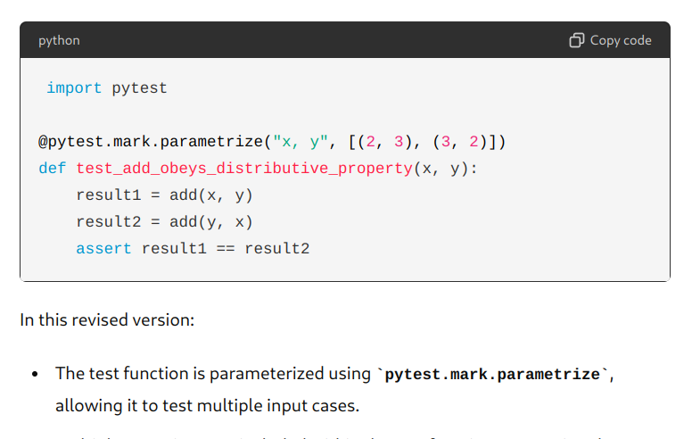

I work outside sometimes, and i wanted to be able to read the code blocks easier in such conditions. I'm sharing what I did to create a simple theme switcher that works well enough for python/html at this time as far as what I've lightly tested. Example:

To achieve the above:

1. Use "Code Injector" web extension to inject

`function toggleMode() { const body = document.body; body.classList.toggle('light-mode'); }`

2. Use Stylus extension to apply these css rules: [https://userstyles.world/style/16503/chatgpt-may-2024](https://userstyles.world/style/16503/chatgpt-may-2024)

3. Now `toggleMode()`in browser console will apply the light theme

Open to feedback! I looked around and didn't find anything. I assume there is a way to specifically interface more neatly with highlight js attributes and to use localhost sourced code themes to avoid CSP issues.
